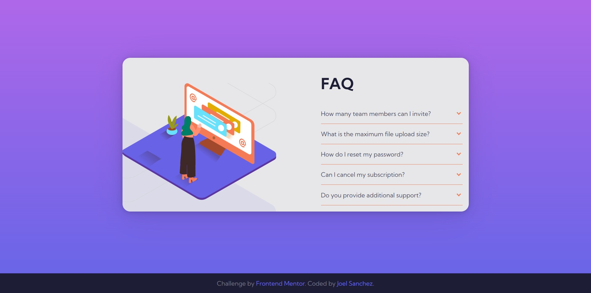

# Frontend Mentor - FAQ accordion card solution

This is a solution to the [FAQ accordion card challenge on Frontend Mentor](https://www.frontendmentor.io/challenges/faq-accordion-card-XlyjD0Oam). Frontend Mentor challenges help you improve your coding skills by building realistic projects. 

## Table of contents

- [Overview](#overview)
  - [The challenge](#the-challenge)
  - [Screenshot](#screenshot)
  - [Links](#links)
- [My process](#my-process)
  - [Built with](#built-with)
  - [Useful Resources](#useful-resources)
- [Author](#author)

## Overview

### The challenge

Users should be able to:

- View the optimal layout for the component depending on their device's screen size
- Hide/Show the answer to a question when the question is clicked
- Complete the challenge without using Javascript

### Screenshot

### Links

- Solution URL: [Github](https://github.com/sanchezdev-1906/frontendmentor---challenge-10)
- Live Site URL: [Github pages](https://sanchezdev-1906.github.io/frontendmentor---challenge-10)

## My process

### Built with

- Semantic HTML5 markup
- CSS custom properties
- CSS Grid
- Mobile-first workflow

### Useful resources

- [Can I use __?](https://caniuse.com/) - For details tag information.

## Author

- Website - [joel-development](https://sanchezdev-1906.github.io/)